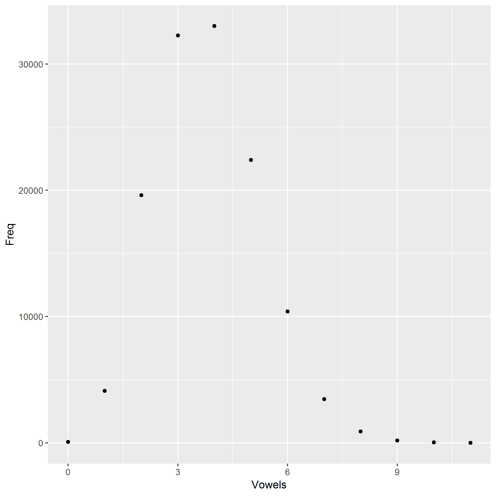

On most *nix systems, the file `/usr/share/dict/words` contains a bunch of words. On my machine, it contains 235886 words.

I computed the number of vowels in each word and tabulated how many words have 0 vowels, 1 vowel, 2 vowels, etc.

The most frequent number of vowels is 4.

